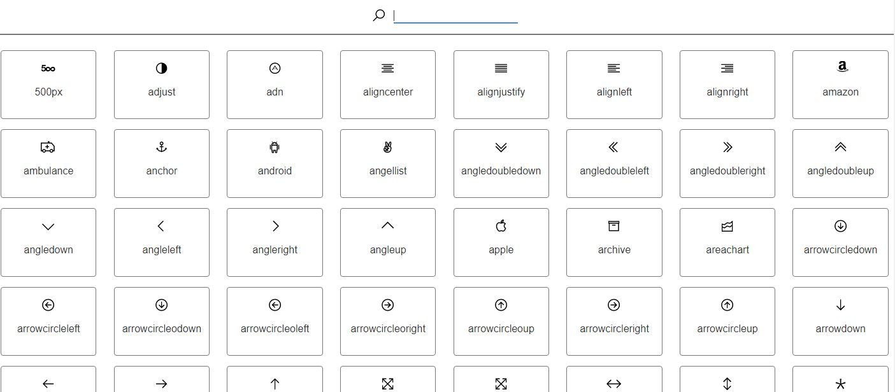

# COMPONENT SVELTE TO USE SVG LIKE AWESOME
Component to display SVG like awesome font
## TO USE IT
The component is in the folder 
>   **Component/SVG.svelte**
```javascript
    <SVG name="search" />
```
or
```javascript
    <SVG 
        name="search" 
        width="128"
        height="128"
    />
```
> default value is **24px**
## TO TEST IT
The test folder is
>  **Example/**
```
    cd Example
    yarn install
    yarn start
```
After compilation, open your browser at location:
> http://localhost:5000

## ENJOY
***
